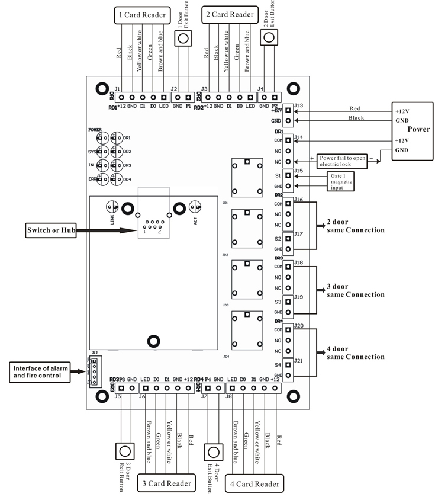
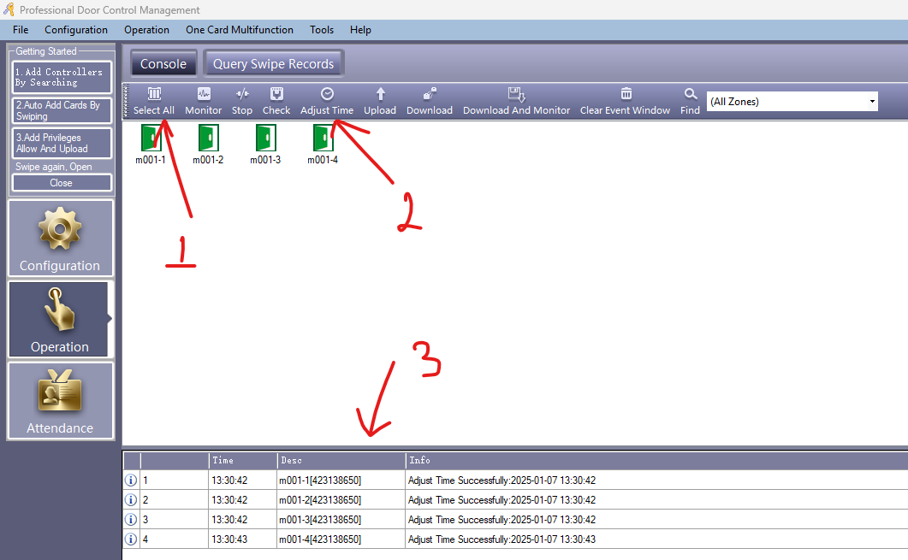
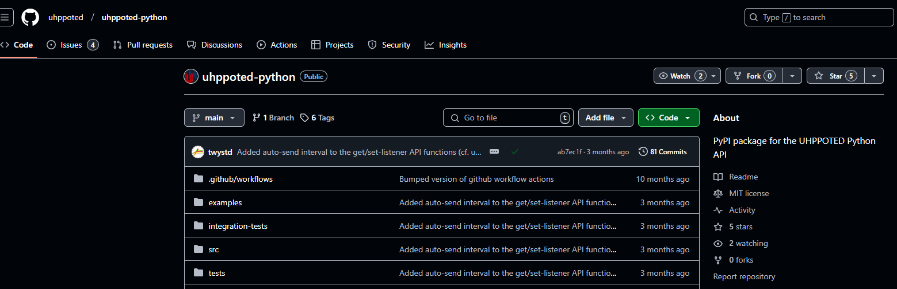
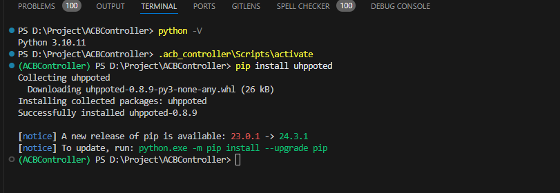
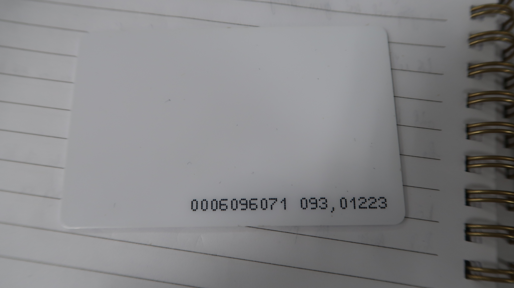

# Hướng dẫn cách lấy dữ liệu từ đầu đọc thẻ `IDTECK` từ bộ điều khiển `ACB-004 Controller`
# Mục lục

[I. Bối cảnh](#i-bối-cảnh)

[II. Đầu đọc thẻ IDTECK IP10](#ii-đầu-đọc-thẻ-idteck-ip10)
- [1. Sản phẩm](#1-sản-phẩm)
- [2. Sơ đồ kết nối](#2-sơ-đồ-kết-nối)

[III. Bộ điều khiển ACB-004](#iii-bộ-điều-khiển-acb---004)
- [1. Sản phẩm](#1-sản-phẩm-1)
- [2. Sơ đồ kết nối](#2-sơ-đồ-kết-nối-1)
- [3. Phần mềm Access Control](#3-phần-mềm-access-control)
    - [1. Một số mật khẩu cần lưu ý của phần mềm Access Control](#1-một-số-mật-khẩu-cần-lưu-ý-của-phần-mềm-access-control)
    - [2. Kết nối ACB-004 với Access Control](#2-kết-nối-acb-004-với-access-control)
    - [3. Kiểm tra dữ liệu quẹt thẻ](#3-kiểm-tra-dữ-liệu-quẹt-thẻ)
- [4. Một số lỗi khi sử dụng ACB-004](#4-một-số-lỗi-khi-sử-dụng-acb-004)
    - [1. Cách nhận biết lỗi](#1-cách-nhận-biết-lỗi)
    - [2. Thời gian không khớp với hiện tại](#2-thời-gian-không-khớp-với-hiện-tại)
    - [3. Không thể xem được chức năng Monitor](#3-không-thể-xem-được-chức-năng-monitor)

[IV. Đọc dữ liệu từ bộ điều khiển bằng Python](#iv-đọc-dữ-liệu-từ-bộ-điều-khiển-bằng-python)
- [1. Thư viện Uhppoted](#1-thư-viện-uhppoted)
- [2. Kết nối với bộ điều khiển ACB 004 bằng Python](#2-kết-nối-với-bộ-điều-khiển-acb-004-bằng-python)
    - [1. Một số thông số mặc định](#1-một-số-thông-số-mặc-định)
    - [2. Lấy thông tin về bộ điều khiển](#2-lấy-thông-tin-về-bộ-điều-khiển)
    - [3. Lấy dữ liệu khi quẹt thẻ](#3-lấy-dữ-liệu-khi-quẹt-thẻ)


# I. Bối cảnh

Tôi cần biết được một số thông tin mỗi khi có người quẹt thẻ từ vào đầu đọc thẻ từ.  


# II. Đầu đọc thẻ IDTECK IP10
## 1. Sản phẩm

Đây là đầu đọc thẻ từ mà tôi đang sử dụng `IDTECK IP10`.  


## 2. Sơ đồ kết nối
Ta có sơ đồ kết nối của đầu đọc thẻ như sau:  


Ta chỉ phục vụ mục đích lấy dữ liệu mỗi khi có người quẹt thẻ nên ta chỉ cần quan tâm tới các dây sau:  

> Red: Là nguồn vào 12V (Cực dương)  
> Black: Là nguồn vào 0V (Cực âm)  
> Green: Data 0 out  
> White: Data 1 out  
> Brown: RS232 (Nếu dùng RS232)  

Ta cần có nguồn 12V để cung cấp cho đầu đọc thẻ này, tuy nhiên bộ điều khiển `ACB-004` có sẵn nguồn 12V nên ta không cần kết nối nguồn khác nữa.  

# III. Bộ điều khiển ACB - 004
## 1. Sản phẩm
Để đọc được dữ liệu từ bộ điều khiển thì tôi lựa chọn bộ điều khiển `ACB-004` để lấy dữ liệu.  


Nó có thể kết nối tới 4 đầu đọc thẻ cùng 1 lúc. Ta kết nối nó như sau.  

## 2. Sơ đồ kết nối



Cấp nguồn 12V cho bộ điều khiển ở vị trí `access power supply` ta tiến hành đấu nối dây như hướng dẫn trên bảng mạch gồm:  

> GND: Là nguồn 0V (Cực âm)  
> +12V: Là nguồn 12V (Cực dương)  

Xem hình ảnh minh họa bên dưới (dây nâu là +12V, dây xanh là 0V)


Kết nối với đầu đọc thẻ từ tại 4 vị trí `Access reader` như hướng dẫn trên bảng mạch gồm:  

> 12V: Là nguồn 12V cho đầu đọc thẻ (Tương ứng với dây đỏ của IDTECK)  
> 0V: Là nguồn 0V cho đầu đọc thẻ (Tương ứng với dây đen của IDTECK)  
> D1: Là Data 1 out (Tương ứng với dây trắng của IDTECK)  
> D0: Là Data 0 out (Tương ứng với dây xanh của IDTECK)  
> LED: Hình như là chức năng đổi màu của đầu đọc thẻ từ (Mình không sử dụng nên chưa tìm hiểu nó có chức năng gì)  

Để chi tiết hơn có thể tham khảo cách đấu nối ở hình ảnh bên dưới:  


Theo thứ tự dây `Đỏ`, `Đen`, `Trắng`, `Xanh lá cây` như hình ảnh bên trên  

## 3. Phần mềm Access Control
Bộ điều khiển này có phần mềm riêng để có thể cấu hình bộ điều khiển cũng như kiểm tra các tác vụ liên quan đến bộ điều khiển. Tải phần mềm về [tại đây](Setup/Software-ACB-001-002-004.rar).  
Giải nén nó ra và chạy tệp tin `setup.exe` như hình bên dưới:  


Sau khi cài đặt xong sẽ có một phần mềm tên là `Access Control`.  

### 1. Một số mật khẩu cần lưu ý của phần mềm Access Control
Mở phần mềm đó lên và đăng nhập với thông tin như sau:  


> User Name: `abc`  
> Password: `123`  

Sau khi đăng nhập sẽ vào giao diện chính như sau:  


Để sử dụng chức năng `Tool --> Extended Function` ta cũng cần cung cấp mật khẩu.  


> Password: `5678`  

Sau đó mở ra giao diện tool với một số chức năng ta có thể dùng như bên dưới:  


Mặc định khi tải về thì phần mềm chỉ được dùng thử. Sau khi hết hạn bạn sẽ không thể truy cập được nữa. Ta sẽ đăng ký bằng cách vào `Help --> About --> Register` dựa trên một số thông tin sau:  


> Company Nam: `s4a`  
> Building Company: `s4a`  
> Register Code: `2004`  

Như vậy chỉ cần ấn nút `OK` để khởi động lại chương trình là đã đăng ký thành công.  


Còn một mật khẩu cuối cùng nữa đấy là tệp tin `ICCard3000: Microsoft Access Database (.mdb)` để xem dữ liệu.  


> Mật khẩu sẽ là: `168168`  

### 2. Kết nối acb-004 với access control

Ta cắm dây ethernet từ cổng TCP/IP của `ACB-004` vào máy tính.  


Nếu cắm thành công thì ta sẽ thấy đèn màu xanh phía bên phải `cổng TCP/IP` sáng màu. Và khi quẹt thẻ thì đèn màu cam sẽ nhấp nháy báo hiệu đã truyền/nhận tín hiệu.  
Tiếp theo vào phần mềm `Access Control` và tìm kiếm controller bằng cách dùng chức năng `Add Controller By Searching` như hình ảnh bên dưới:  


Sau khi thêm bộ điều khiển xong thì bạn vào `Configuration` và chọn `Controller` để xem danh sách các bộ điều khiển đã thêm vào.  


Như hình ảnh bên trên tôi đã thêm bộ điều khiển `ACB-004` của mình thành công. Nó sẽ cho chúng ta một số thông tin về bộ điều khiển mà ta cần lưu ý như sau:  

> SN: Serial number  
> IP: Địa chỉ IP của controller  
> Port: Cổng kết nối  

Để chỉnh sửa bộ điều khiển thì ta nhấn đúp vào bộ điều khiển đó.  


Ta chỉ nên thay đổi địa chỉ IP của bộ điều khiển sao cho cùng dải mạng với máy tính là được, các thông số khác để nguyên.  

### 3. Kiểm tra dữ liệu quẹt thẻ
Để xem thông tin dữ liệu khi quẹt thẻ, ta vào chức năng `Operation` như hình ảnh dưới đây:  


Ta vào `Operation` sau đó ấn `Select All` để chọn hết các cửa và ấn `Monitor` để quan sát sự kiện quẹt thẻ.  
Khi đó mỗi khi ta đưa thẻ gần đầu đọc thẻ đủ để nhận tín hiệu thì dữ liệu sẽ được hiển thị tại ô bên dưới. Thông tin sẽ được hiển thị tại cột `Infor`.  
Như vậy ta đã có thể xác nhận được rằng hệ thống đã hoạt động ổn định, chuyển sang bước tiếp theo là đọc dữ liệu bằng `python`.  

## 4. Một số lỗi khi sử dụng ACB-004
### 1. Cách nhận biết lỗi
Ta có thể nhận biết có lỗi bằng cách quan sát các đèn `LED trên bảng mạch (LED indicator)` của bộ điều khiển như hình dưới đây:  


Đèn dưới cùng màu đỏ, có tên `ERR` nó sẽ sáng nhẹ hoặc nhấp nháy thì báo hiệu lỗi. Một số lỗi phổ biến mà mình từng gặp dưới đây.  

### 2. Thời gian không khớp với hiện tại
Đây là lỗi mình thường xuyên gặp nhất (Và nó cũng không ảnh hưởng gì hệ thống cả ngoài thời gian sai), chỉ cần mất điện hoặc nguồn điện không ổn định, khiến cho bộ điều khiển không được cung cấp điện. Sau đó khởi động lại bộ điều khiển thì đèn báo `ERR` sáng lên.  

Cách khắc phục là ta sẽ vào phần mềm `Access Control` để điều chỉnh lại thời gian cho bộ điều khiển.  



Ta vào `Operation` sau đó chọn `Select All` để chọn hết cửa và nhấn vào chức năng `Adjust Time` để cập nhật lại thời gian của bộ điều khiển. Nếu thành công nó sẽ báo xanh như vị trí số 3 ở trên.  

### 3. Không thể xem được chức năng Monitor
Lỗi này khiến khi mình sử dụng chức năng `monitor` sẽ không xem được sự kiện quẹt thẻ. Dấu hiện nhận biết là hình cánh cửa không mở ra và có màu xanh như bình thường. Thay vào đó là nó có hình như dưới đây.  


Để sửa lỗi này thì các bạn cũng tương tự như thời gian. Tuy nhiên các bạn không dùng chức năng `Adjust Time` mà sử dụng chức năng `Check`.  


Nó sẽ mở ra cửa sổ mới và bạn nhấn vào chức năng `Auto configuration ...`. Sau đó nó sẽ tự động sửa lỗi.  


# IV. Đọc dữ liệu từ bộ điều khiển bằng Python

## 1. Thư viện uhppoted



Để kết nối được với bộ điều khiển `ACB-004` ta sử dụng thư viện `Uhppoted`. Có thể tham khảo chi tiết [tại đây](https://github.com/uhppoted/uhppoted-python).  
Ta cài đặt thư viện này bằng câu lệnh sau:  

```python 
pip install uhppoted
```



Ta đã cài đặt thành công thư viện `uhppoted` trong môi trường ảo. Để tham khảo về cách làm việc với môi trường ảo thì tìm hiểu tại repository [Virtual_enviroment_python](https://github.com/NguyenDucQuan12/virtual_environment_python).  

## 2. Kết nối với bộ điều khiển ACB-004 bằng python
### 1. Một số thông số mặc định

```
bind        IPv4 address to which to bind the UDP socket. Defaults to 0.0.0.0
broadcast   IPv4 address:port for broadcast UDP packets. Defaults to 255.255.255.255:60000
listen      IPv4 address:port for events from controller (unused). Defaults to 0.0.0.0:60001
debug       Displays the controller requests/responses if true.
```
> `Bind`: Địa chỉ 0.0.0.0 có nghĩa là socket sẽ lắng nghe trên tất cả các giao diện mạng của máy tính. Nếu muốn lắng nghe trên một giao diện mạng cụ thể thì đặt giá trị này thành giá trị IP cụ thể (192.168.1.100)  
> `Broadcast`: 255.255.255.255 là địa chỉ broadcast chuẩn, nghĩa là gói tin sẽ được gửi tới tất cả các thiết bị trong cùng một mạng. Thông thường, broadcast được dùng để thông báo thông tin cho tất cả các thiết bị trong mạng mà không cần biết trước địa chỉ IP cụ thể của chúng.  
> `Listen`: Tương tự như bind, 0.0.0.0 ở đây cho phép socket lắng nghe sự kiện từ tất cả các giao diện mạng. Mặc dù thông số này "unused" (không sử dụng), nhưng vẫn được cấu hình để phù hợp với các thiết lập giao tiếp mạng tiềm năng.  
> `Debug`: Khi bật debug (giá trị true), các thông báo liên quan đến việc gửi/nhận dữ liệu từ controller sẽ được hiển thị trên màn hình. Khi giá trị là false, các thông báo này sẽ bị tắt để tránh gây nhiễu khi chạy trong môi trường thực tế.  

### 2. Lấy thông tin về bộ điều khiển

Để truy cập thông tin đến bộ điều khiển `ACB Controller` ta tạo kết nối đến server và sử dụng hàm `get_controller` để lấy thông tin.  
Sử dụng 1 trong 5 phương thức để lấy thông tin bộ điều khiển như sau:  
```python
get_controller(serial_number)
get_controller((serial_number, 'IP', 'tcp'))
get_controller((serial_number, 'IP:60000', 'tcp'))
get_controller((serial_number, 'IP'))
get_controller((serial_number, 'IP:60000'))
```

Ví dụ về sử dụng phương thức 1 hoặc 2 như bên dưới:  

```python 
from uhppoted import uhppote
from pprint import pprint

bind = '0.0.0.0'
broadcast = '255.255.255.255:60000'
listen = '0.0.0.0:60001'
debug = True

u = uhppote.Uhppote(bind, broadcast, listen, debug)
# Lấy thông tin bộ điều khiển bằng serial number
record = u.get_controller(423138650)

# Lấy thông tin controller bằng serial number, ip:port, phương thức TCP
record = u.get_controller((423138650, '169.254.184.123:60000', 'tcp'))

pprint(record.__dict__, indent=2, width=1)
```
Kết quả trả về như sau:  

```console
   00000000  17 94 00 00 5a 95 38 19  00 00 00 00 00 00 00 00
   00000010  00 00 00 00 00 00 00 00  00 00 00 00 00 00 00 00
   00000020  00 00 00 00 00 00 00 00  00 00 00 00 00 00 00 00
   00000030  00 00 00 00 00 00 00 00  00 00 00 00 00 00 00 00

   00000000  17 94 00 00 5a 95 38 19  a9 fe b8 7b ff ff 00 00
   00000010  a9 fe b8 01 00 66 19 38  95 5a 06 62 20 15 12 15
   00000020  00 00 00 00 00 00 00 00  00 00 00 00 00 00 00 00
   00000030  00 00 00 00 00 00 00 00  00 00 00 00 00 00 00 00

{ 'controller': 423138650,
  'date': datetime.date(2015, 12, 15),
  'gateway': IPv4Address('169.254.184.1'),
  'ip_address': IPv4Address('169.254.184.123'),
  'mac_address': '00:66:19:38:95:5a',
  'subnet_mask': IPv4Address('255.255.0.0'),
  'version': 'v6.62'}
```

Nếu đặt `Debug = False` thì kết quả trả về như sau:  

```
{ 'controller': 423138650,
  'date': datetime.date(2015, 12, 15),
  'gateway': IPv4Address('169.254.184.1'),
  'ip_address': IPv4Address('169.254.184.123'),
  'mac_address': '00:66:19:38:95:5a',
  'subnet_mask': IPv4Address('255.255.0.0'),
  'version': 'v6.62'}
```

Để lấy hết thông tin của các bộ điều khiển đang kết nối cùng một mạng ta sử dụng hàm `get_all_controllers`:  

```python
from uhppoted import uhppote

bind = '0.0.0.0'
broadcast = '255.255.255.255:60000'
listen = '0.0.0.0:60001'
debug = False

u = uhppote.Uhppote(bind, broadcast, listen, debug)
record = u.get_all_controllers()

for i, rec in enumerate(record):
    print(rec.__dict__)
```

Có một số cách để hiển thị thông tin bộ điều khiển:  

Ta hiển thị từng giá trị cụ thể:  
```python
# Hiển thị từng giá trị cụ thể
print("Controller:", record[0].controller)
print("Date:", record[0].date)
print("Gateway:", record[0].gateway)
print("IP Address:", record[0].ip_address)
print("MAC Address:", record[0].mac_address)
print("Subnet Mask:", record[0].subnet_mask)
print("Version:", record[0].version)
```
Nếu đối tượng là một class hoặc instance, bạn có thể dùng vars() hoặc __dict__ để hiển thị toàn bộ thuộc tính:  

```python
print(record[0].__dict__)
# Hoặc dùng vars
# Hiển thị tất cả thuộc tính của object đầu tiên trong record
print(vars(record[0]))
```
Hoặc có thể sử dụng thư viện `pprint` để hiển thị dữ liệu có cấu trúc đẹp hơn:  

```python 
# Hoặc từng object trong danh sách
for rec in record:
    pprint(rec.__dict__)
```
Kết quả như sau:  
```
{ 'controller': 423138650,
  'date': datetime.date(2015, 12, 15),
  'gateway': IPv4Address('169.254.184.1'),
  'ip_address': IPv4Address('169.254.184.123'),
  'mac_address': '00:66:19:38:95:5a',
  'subnet_mask': IPv4Address('255.255.0.0'),
  'version': 'v6.62'}
```

### 3. Lấy dữ liệu khi quẹt thẻ

Thẻ mà ta sử dụng gọi là `RFID Proximity`. Nó thường có 2 dãy số là `Mã Wiegand` và `Mã ABA`.  



> Mã Wiegand:  
> Vị trí: Thường được in bên trái bề mặt thẻ.  
> Cấu trúc: Gồm 10 chữ số, trong đó 5 số đầu là `Site code (mã địa điểm)` và 5 số sau là `Card code (mã thẻ)`.  
> Ý nghĩa: Site code xác định địa điểm hoặc hệ thống mà thẻ được đăng ký, còn Card code là mã duy nhất của thẻ trong hệ thống đó  
> Mã ABA:  
> Vị trí: Thường được in bên phải bề mặt thẻ.  
> Cấu trúc: Gồm 10 chữ số, được chuyển đổi từ mã Wiegand theo công thức: `Site code * 65536 + Card code = ABA code`.  
> Ý nghĩa: Mã ABA là một dạng mã hóa khác của mã Wiegand, giúp hệ thống dễ dàng quản lý và xác thực thông tin thẻ  

Như hình ảnh phía trên thì `mã wiegand` là: `09301223` còn `mã aba` là: `0006096071` (Hơi ngược so với thông tin cung cấp).  
Chương trình của chúng ta chỉ đọc được `9301223` bởi vì nó truyền thông tin tin hiệu `26 bit wiegand` vì vậy đây là `Mã Wiegand`. Từ đó ta suy luận ra `Mã ABA` là ` 93*65536 + 1223 = 6096071`.  

Để lấy dữ liệu id code của thẻ từ thì các bạn chạy file code tại tệp [get_id_card.py](Code/get_id_card.py).  
Chỉ cần thay đổi giá trị `Serrial Number` của thiết bị `ACB Controller` của các bạn cho phù hợp là được.  

```python
 def __init__(self, function=None):
        
        controller = 423138650  # controller serial number
```