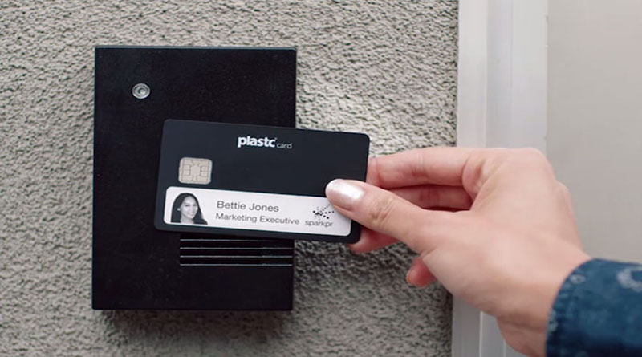
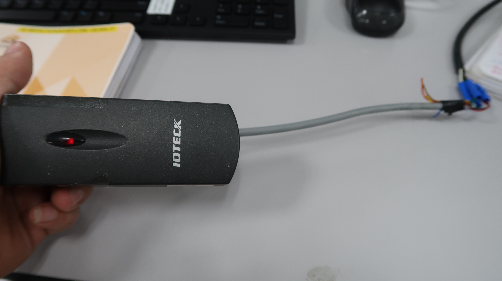
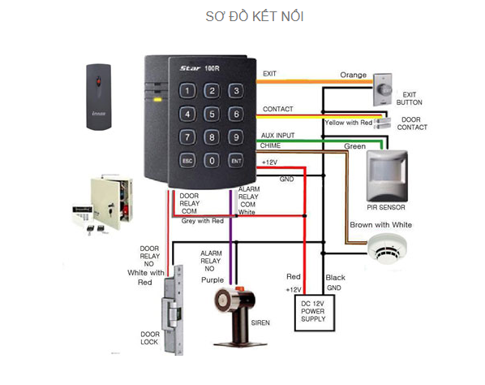

# Hướng dẫn cách lấy dữ liệu từ đầu đọc thẻ `IDTECK` từ bộ điều khiển `ACB-004 Controller`
# Mục lục

[I. Bối cảnh](#i-bối-cảnh)

[II. Đầu đọc thẻ IDTECK IP10](#ii-đầu-đọc-thẻ-idteck-ip10)
- [1. Sản phẩm](#1-sản-phẩm)
  - [1. Kết nối bằng cáp USB-A](#1-Kết-nối-bằng-cáp-usb---a)
  - [2. Kết nối bằng ethernet](#2-Kết-nối-bằng-ethernet)

[III. Bộ điều khiển ACB-004](#iii-bộ-điều-khiển-acb---004)

# I. Bối cảnh

Tôi cần biết được một số thông tin mỗi khi có người quẹt thẻ từ vào đầu đọc thẻ từ.  

# II. Đầu đọc thẻ IDTECK IP10
## 1. Sản phẩm

Đây là đầu đọc thẻ từ mà tôi đang sử dụng `IDTECK IP10`.  

Ta có sơ đồ kết nối của đầu đọc thẻ như sau:  

Ta chỉ phục vụ mục đích lấy dữ liệu mỗi khi có người quẹt thẻ nên ta chỉ cần quan tâm tới các dây sau:  

> Red: Là nguồn vào 12V (Cực dương)  
> Black: Là nguồn vào 0V (Cực âm)  
> Green: Data 0 out  
> White: Data 1 out  
> Brown: RS232 (Nếu dùng RS232)  

Ta cần có nguồn 12V để cung cấp cho đầu đọc thẻ này, tuy nhiên bộ điều khiển `acb-004` có sẵn nguồn 12V nên ta không cần kết nối nguồn khác nữa.  

# III. Bộ điều khiển ACB - 004
