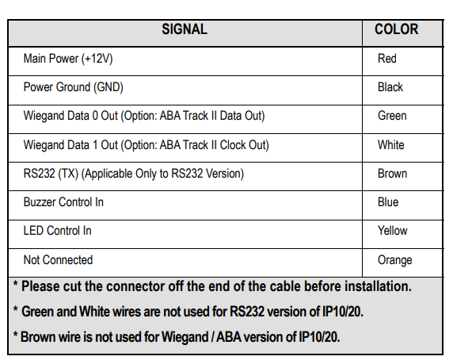

# Hướng dẫn cách lấy dữ liệu từ đầu đọc thẻ `IDTECK` từ bộ điều khiển `ACB-004 Controller`
# Mục lục

[I. Bối cảnh](#i-bối-cảnh)

[II. Đầu đọc thẻ IDTECK IP10](#ii-đầu-đọc-thẻ-idteck-ip10)
- [1. Sản phẩm](#1-sản-phẩm)
- [2. Sơ đồ kết nối](#2-sơ-đồ-kết-nối)

[III. Bộ điều khiển ACB-004](#iii-bộ-điều-khiển-acb---004)
- [1. Sản phẩm](#1-sản-phẩm-1)
- [2. Sơ đồ kết nối](#2-sơ-đồ-kết-nối-1)
- [3. Phần mềm Access Control](#3-phần-mềm-access-control)
    - [1. Kết nối ACB-004 với Access Control](#1-kết-nối-acb-004-với-access-control)
    - [2. Kiểm tra dữ liệu quẹt thẻ](#2-kiểm-tra-dữ-liệu-quẹt-thẻ)

# I. Bối cảnh

Tôi cần biết được một số thông tin mỗi khi có người quẹt thẻ từ vào đầu đọc thẻ từ.  

# II. Đầu đọc thẻ IDTECK IP10
## 1. Sản phẩm

Đây là đầu đọc thẻ từ mà tôi đang sử dụng `IDTECK IP10`.  

## 2. Sơ đồ kết nối
Ta có sơ đồ kết nối của đầu đọc thẻ như sau:  

Ta chỉ phục vụ mục đích lấy dữ liệu mỗi khi có người quẹt thẻ nên ta chỉ cần quan tâm tới các dây sau:  

> Red: Là nguồn vào 12V (Cực dương)  
> Black: Là nguồn vào 0V (Cực âm)  
> Green: Data 0 out  
> White: Data 1 out  
> Brown: RS232 (Nếu dùng RS232)  

Ta cần có nguồn 12V để cung cấp cho đầu đọc thẻ này, tuy nhiên bộ điều khiển `acb-004` có sẵn nguồn 12V nên ta không cần kết nối nguồn khác nữa.  

# III. Bộ điều khiển ACB - 004
## 1. Sản phẩm
Để đọc được dữ liệu từ bộ điều khiển thì tôi lựa chọn bộ điều khiển `acb-004` để lấy dữ liệu.  

Nó có thể kết nối tới 4 đầu đọc thẻ cùng 1 lúc. Ta kết nối nó như sau.  

## 2. Sơ đồ kết nối
Cấp nguồn 12V cho bộ điều khiển ở vị trí `access power supply` ta tiến hành đấu nối dây như hướng dẫn trên bảng mạch gồm:  

> GND: Là nguồn 0V (Cực âm)  
> +12V: Là nguồn 12V (Cực dương)  

Xem hình ảnh minh họa bên dưới (dây nâu là +12V, dây xanh là 0V)

Kết nối với đầu đọc thẻ từ tại 4 vị trí `Access reader` như hướng dẫn trên bảng mạch gồm:  

> 12V: Là nguồn 12V cho đầu đọc thẻ (Tương ứng với dây đỏ của IDTECK)  
> 0V: Là nguồn 0V cho đầu đọc thẻ (Tương ứng với dây đen của IDTECK)  
> D0: Là Data 0 out (Tương ứng với dây xanh của IDTECK)  
> D1: Là Data 1 out (Tương ứng với dây trắng của IDTECK)  
> LED: (Mình không sử dụng nên chưa tìm hiểu nó có chức năng gì)  

Để chi tiết hơn có thể tham khảo cách đấu nối ở hình ảnh bên dưới:  

Mình đang đấu nhầm dây `D0` và `D1` ngược nhau. Tuy nhiên nó vẫn hoạt động tốt, đừng ngược nguồn `12V` và `0V` là được.  

## 3. Phần mềm Access Control
Bộ điều khiển này có phần mềm riêng để có thể cấu hình bộ điều khiển cũng như kiểm tra các tác vụ liên quan đến bộ điều khiển. Tải phần mềm về [tại đây](Setup/Software-ACB-001-002-004.rar).  
Giải nén nó ra và chạy tệp tin `setup.exe` như hình bên dưới:  

Sau khi cài đặt xong sẽ có một phần mềm tên là `Access Control`. Mở phần mềm đó lên và đăng nhập với thông tin như sau:  

> User Name: `abc`  
> Password: `123`  

Sau khi đăng nhập sẽ vào giao diện chính như sau:  

Để sử dụng chức năng `Tool --> Extended Function` ta sử dụng mật khẩu `5678`.  

Sau đó mở ra giao diện tool với một số chức năng ta có thể dùng như bên dưới:  

Mặc định khi tải về thì phần mềm chỉ được dùng thử. Sau khi hết hạn bạn sẽ không thể truy cập được nữa. Ta sẽ đăng ký bằng cách vào `Help --> About --> Register` dựa trên một số thông tin sau:  

> Company Nam: `s4a`  
> Building Company: `s4a`  
> Register Code: `2004`  

Như vậy chỉ cần ấn nút `OK` để khởi động lại chương trình là đã đăng ký thành công.  

Còn một mật khẩu cuối cùng nữa đấy là tệp tin `ICCard3000: Microsoft Access Database (.mdb)` để xem dữ liệu.  

> Mật khẩu sẽ là: `168168`  

### 1. Kết nối acb-004 với access control

Ta cắm dây ethernet từ `acb-004` vào máy tính.  

Nếu cắm thành công thì ta sẽ thấy đèn màu xanh phía bên phải `cổng TCP/IP` sáng màu. Và khi quẹt thẻ thì đèn màu cam sẽ nhấp nháy báo hiệu đã truyền/nhận tín hiệu.  
Tiếp theo vào phần mềm `Access Control` và tìm kiếm controller bằng cách dùng chức năng `Add Controller By Searching` nhưu hình ảnh bên dưới:  

Sau khi thêm bộ điều khiển xong thì bạn vào `Configuration` và chọn `Controller` để xem danh sách các bộ điều khiển đã thêm vào.  

Như hình ảnh bên trên tôi đã thêm bộ điều khiển `acb-004` của mình thành công. Nó sẽ cho chúng ta một số thông tin về bộ điều khiển mà ta cần lưu ý như sau:  

> SN: Serial number  
> IP: Địa chỉ IP của controller  
> Port: Cổng kết nối  

Để chỉnh sửa bộ điều khiển thì ta nhấn đúp vào bộ điều khiển đó.  

Ta chỉ nên thay đổi địa chỉ IP của bộ điều khiển sao cho cùng dải mạng với máy tính là được, các thông số khác để nguyên.  

### 2. Kiểm tra dữ liệu quẹt thẻ
Để xem thông tin dữ liệu khi quẹt thẻ, ta vào chức năng `Operation` như hình ảnh dưới đây:  

Khi đó mỗi khi ta đưa thẻ gần đầu đọc thẻ đủ để nhận tín hiệu thì dữ liệu sẽ được hiển thị tại ô bên dưới. Thông tin sẽ được hiển thị tại cột `Infor`.  
Như vậy ta đã có thể xác nhận được rằng hệ thống đã hoạt động ổn định, chuyển sang bước tiếp theo là đọc dữ liệu bằng python.  
